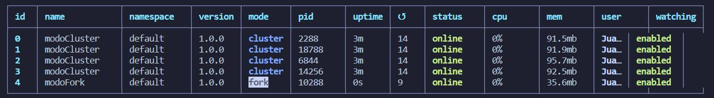
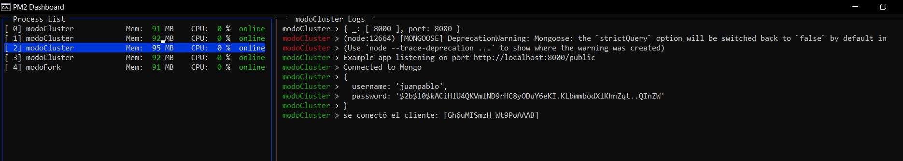
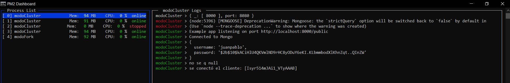

# DESAFIO 15

1. Ejecutar el archivo tablaProductos.js para crear la tabla de productos en MySQL e insertar los productos
2. Iniciar con XAMPP el servidor de la base de datos MySQL, este se ejecutará en el puerto 3306

## Usuario ya registrado

**Nombre de usuario:** juanpablo <br/>
**Contraseña:** juanpablopass

En la ruta /public/info ahora podemos ver el número de procesadores que tiene el servidor <br/>

## Consigna 1 (PM2)

Podemos ejecutar el servidor utilizando PM2 en modo fork y cluster con los siguientes comandos (respetar el orden para evitar errores) <br/>

```
pm2 start server.js --name="modoCluster" --watch -i max -- -- 8000
pm2 start server.js --name="modoFork" --watch -- -- 8001
```

Estos ejecutan el modo cluster en el puerto 8000 y el modo fork en el puerto 8001, ambos actualizan automáticamente el código del servidor mediante el flag `-i max` <br/>

Podemos ver la lista de procesos con el comando `pm2 list` <br/>



Al detener el proceso fork podemos observar que el servidor en el puerto 8001 se cae y no podemos ingresar a la página <br/>

Al ingresar mediante el puerto 8000 vemos que el servidor asigna el proceso a un cluster, en este caso 2 <br/>



si finalizamos este proceso el servidor reasigna automáticamente al cliente a otro cluster diferente <br/>



## Consigna 2 (NGINX)

Se agregó un servidor de proxy inverso con NGINX para la ruta `/api/randoms`, este redirige al usuario balanceando la carga de cada proceso en 5 puertos diferentes, cada uno con igual peso. <br/>
Ejecutar las siguientes líneas para iniciar el servidor con pm2 en modo fork en los puertos 8082, 8083, 8084 y 8085 <br/>

```
pm2 start server.js --name="modoFork8082" --watch -- -- 8002
pm2 start server.js --name="modoFork8083" --watch -- -- 8083
pm2 start server.js --name="modoFork8084" --watch -- -- 8084
pm2 start server.js --name="modoFork8085" --watch -- -- 8085

```

Luego en la ruta `Desafio15/nginx-1.23.3` ejecutar `./nginx.exe` <br/>

Podemos comprobar el funcionamiento del proxy ingresando a la ruta `localhost/api/randoms`, cada vez que ingresemos nos redireccionará a un puerto diferente
