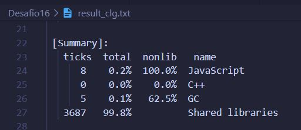
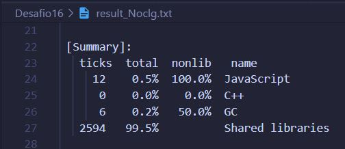
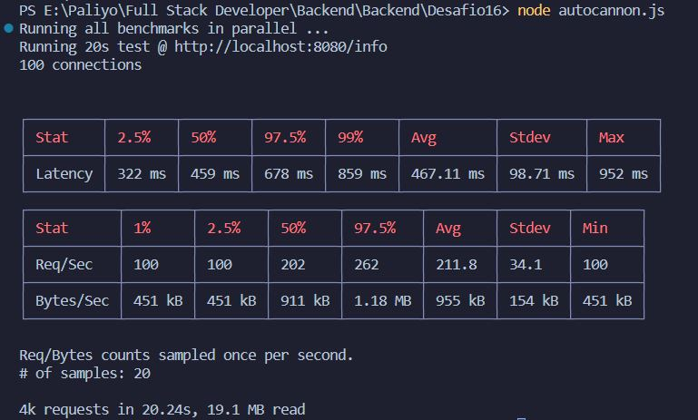
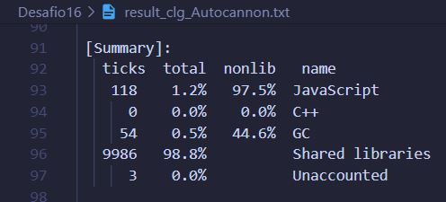
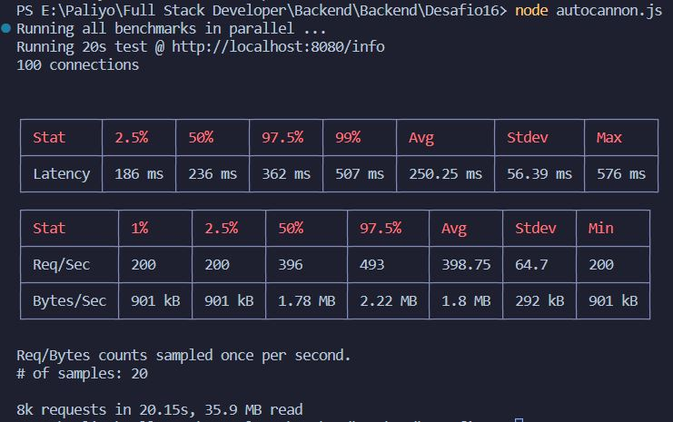
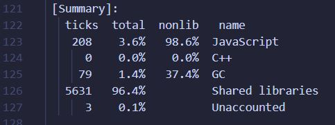
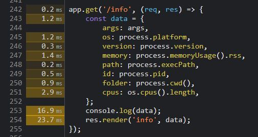
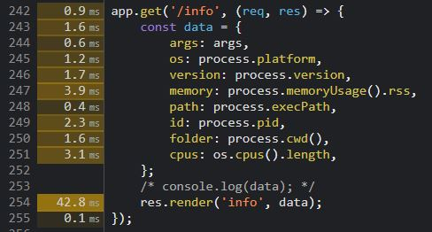

# DESAFIO 16

1. Ejecutar el archivo tablaProductos.js para crear la tabla de productos en MySQL e insertar los productos
2. Iniciar con XAMPP el servidor de la base de datos MySQL, este se ejecutará en el puerto 3306

## Usuario ya registrado

**Nombre de usuario:** juanpablo <br/>
**Contraseña:** juanpablopass

## Consigna 1 (GZIP y Loggeo)

Incorporación del middleware GZIP de compresión para aumentar la velocidad de la aplicación <br/>

Incorporación del loggeo con Winston en 3 niveles: info, warn y error <br/>
**info:** peticiones recibidas <br/>
**warn:** peticiones a rutas inexistentes <br/>
**error:** `catch(err)` en `chatContenedor.js` y `classContenedor.js` <br/>
los 3 se imprimen en consola pero warn y error se guardan en `warn.log` y `error.log` respectivamente <br/>

## Consigna 2 (Análisis de performance)

En base a la ruta /info, con `console.log(data)` y sin `console.log(data)`

1. Análisis con profiler de Node <br/>
   iniciamos el profiler de node con `node --prof server.js`

### Artillery

ejecutamos una línea u otra según el caso

```
artillery quick --count 20 -n 50 "http://localhost:8080/info" > result_Noclg.txt
artillery quick --count 20 -n 50 "http://localhost:8080/info" > result_clg.txt
```

### Autocannon

Ejecutamos `autocannon.js` <br/>
Cerramos el servidor creando un archivo isolated, lo renombramos a `clg-v8.log` y `Noclg-v8.log` <br/>
procesamos estos archivos con:

```
node --prof-process Noclg-v8.log > result_Noclg.txt
node --prof-process clg-v8.log > result_clg.txt

```

Obtenemos los siguientes resultados:

Artillery con console.log()
 <br/>

Artillery sin console.log()
 <br/>

Autocannon con console.log()
 <br/>
 <br/>

Autocannon sin console.log()
 <br/>
 <br/>

2. Análisis con el modo inspector de node en chrome <br/>
   Ejecutamos el servidor con `node --inspect server.js` <br/>
   Ejecutamos `autocannon.js` y en chrome vemos los resultados:

 <br/>
 <br/>

3. Diagrama de flama con 0x <br/>
   Ejecutamos el servidor con `0x server.js` <br/>
   Vemos los resultados en los archivos generados <br/>

Con console.log():
[0x con clg](./flamegraph-clg/flamegraph.html)

Sin console.log():
[0x sin clg](./flameGraph-Noclg/flamegraph.html)
