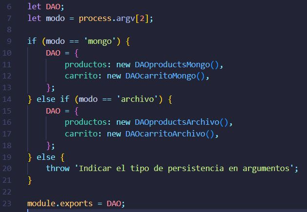
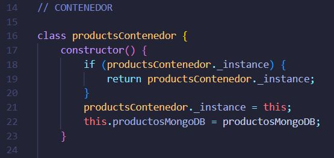
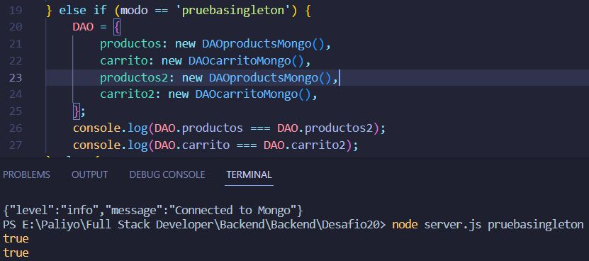

# Desafio 20

Se incorporaron modelos DAO(data access object) y Abstract Factory para la creación de clases constructoras y esquemas. <br/>

Es posible seleccionar el DAO (archivo / MongoDB) mediante el tercer parámetro en la línea de comandos al ejecutar el servidor. Para esto fueron creados los siguientes scripts:

```
"mongo": "node server.js mongo"
"archivo": "node server.js archivo"
```

Este parámetro es leído por la abstract factory y esta selecciona el DAO correspondiente.<br/>

 <br/>

También se incorporó el patrón singletón en cada clase constructora para evitar que se creen múltiples instancias de los DAOS. Al crear una clase en caso de ya haber una existente, retorna la clase ya creada.<br/>
Ejemplo en DAOproductsMongo:<br/>

 <br/>

En la factory abstracta podemos comprobar el correcto funcionamiento al ejecutar el script:

```
"singleton": "node server.js singleton"
```

 <br/>

Vemos que las instancias de productos y productos2, carrito y carrito2 son iguales entre si. Por lo que el patrón singletón está funcionando correctamente.
